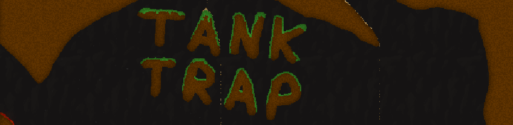
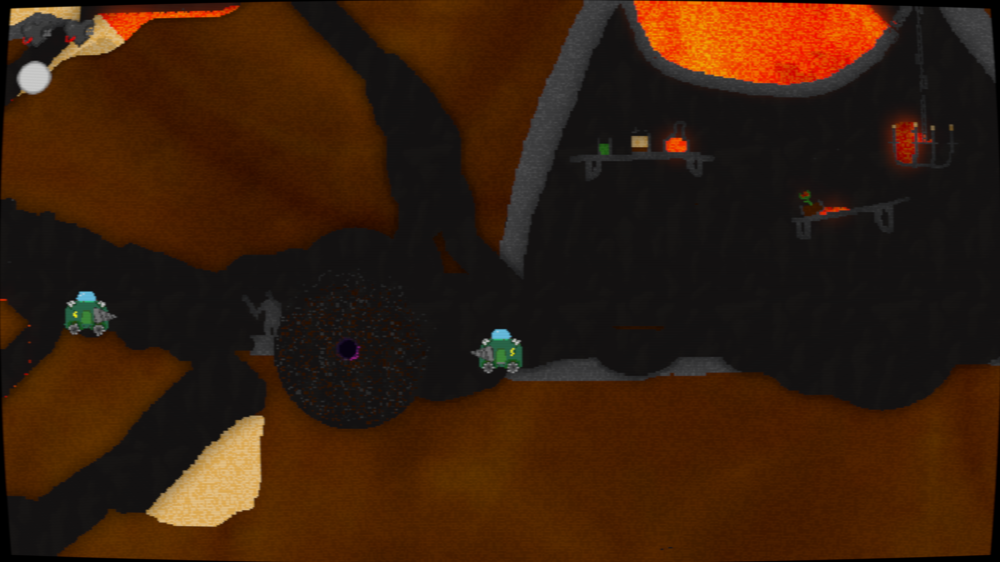

# Tank Trap
**Tank Trap**, formerly Untitled Sand Game, is a Wii U homebrew game made in a game jam with a simple premise. You control a drill tank in a multiplayer arena with dynamic, 2D physics-based terrain, inspired by games like Noita.
It was developed by [@Exzap](https://github.com/Exzap) and [@Crementif](https://github.com/Crementif).

Drill through sand and lava, collect (explosive) items to use against opponents, and watch as the landscape changes with each interaction.
Create traps and obstacles for your opponents to fall into, or use the terrain to burn your enemies in all the chaos.

A sandbox mode is also available for solo play.

## Features
 - Play solo in Sandbox Mode
 - Battle up to 10+ players online
 - Fully multiplayer physics simulation
 - Random item pickups for terrain manipulation
 - Interactive title screen to play around with the physics and materials
 - Dynamic shader effects (made possible with [CafeGLSL](https://github.com/Exzap/CafeGLSL))
 - Works (only) on the Wii U (and Wii U emulators like Cemu), since it was also made as a tech demo for the Wii U

## Screenshots

## How To Install
#### For Wii U:
 1. Download Tank Trap  
    a. Download it by searching Tank Trap in the Homebrew App Store on your Wii U or by visiting [hb-app.store/wiiu/TankTrap](https://hb-app.store/wiiu/TankTrap).  
    b. Download the `sand.wuhb` from the [releases page](https://github.com/Crementif/UntitledSandGame/release), and put the file on your SD card in the `sd:/wiiu/apps` folder.  
 2. Launch Tank Trap from your home screen or homebrew launcher.

#### For Cemu (2.0 only!):
 1. Download the latest `sand.wua` or `sand.wuhb` from the [releases page](https://github.com/Crementif/UntitledSandGame/release) and put it alongside your other Cemu games.
 2. Refresh Cemu's game list and it should appear! You can also load the .wua or .wuhb file file through the `File->Load File` menu option.

## How To Play
 - Use the left stick to move your tank
 - Use the right stick to aim your drill
 - Press A to drill/jump
 - Press B to use your item
 - Press Select to toggle the debug overlay

Secret cheat: In sandbox mode, having the debug overlay open allows you to keep your item after using it, meaning you have infinite items!

## How To Compile

 - Install [devkitPRO](https://devkitpro.org/wiki/Getting_Started)
 - Install devkitPPC and wut through devkitPro's pacman by using `pacman -S wiiu-dev`
 - Run `make` in the root of the project directory

### Credits
 - [@aboood40091](https://github.com/aboood40091) for the original GX2 framework!
 - [@Maschell](https://github.com/Maschell) for RPL loading support on the Wii U!
 - [@GaryOderNichts](https://github.com/GaryOderNichts) for testing and helping with the shader compiler!

### License
This project is licensed under the [MIT License](./LICENSE.md).
The pixel font is licensed under [Creative Commons Attribution license](./source/assets/font/license.txt).
The Zfast-CRT Geo shader is licensed under [GPL2](./source/assets/shaders/crt.ps).
